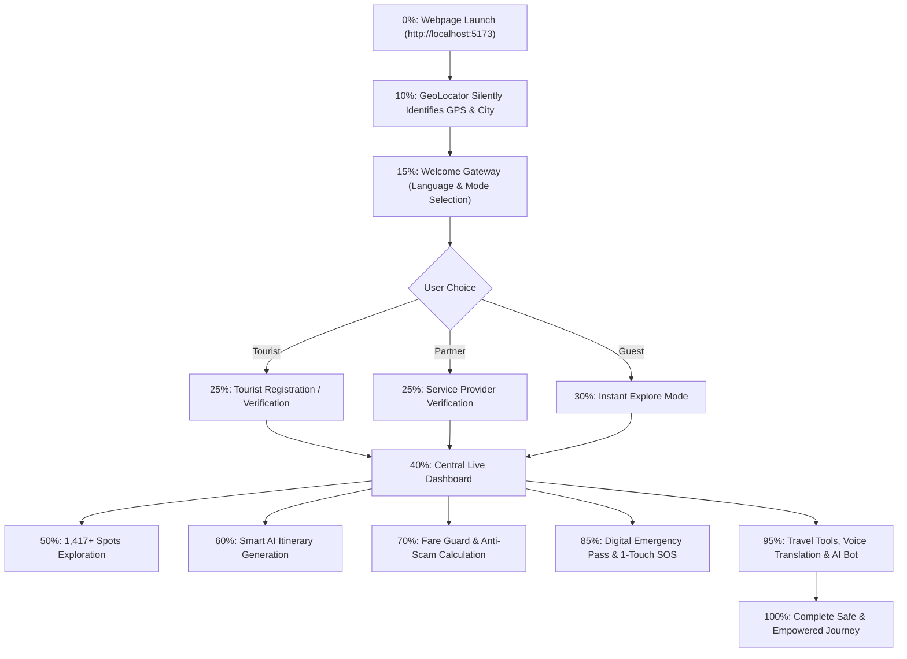

# 🌍 TripNova: Complete 0-to-100 Architecture & Workflow Guide

**TripNova** is a modern, high-performance web platform designed for tourist safety, smart AI trip planning, anti-scam fare estimation, real-time multi-language voice translation, all-India destination discovery (1,417+ verified attractions across 36 States & UTs), and digital emergency tourist passes.

---

## 📑 Table of Contents
1. [Executive Summary & Concept](#1-executive-summary--concept)
2. [Technology Stack & System Architecture](#2-technology-stack--system-architecture)
3. [The 0-to-100 End-to-End Workflow](#3-the-0-to-100-end-to-end-workflow)
   - [Phase 1: Entry & Geolocation Gateway (0% – 15%)](#phase-1-entry--geolocation-gateway-0--15)
   - [Phase 2: Identity, Registration & Verification (15% – 30%)](#phase-2-identity-registration--verification-15--30)
   - [Phase 3: Central Command Center / Live Dashboard (30% – 45%)](#phase-3-central-command-center--live-dashboard-30--45)
   - [Phase 4: All-India Tourist Spots Explorer (45% – 55%)](#phase-4-all-india-tourist-spots-explorer-45--55)
   - [Phase 5: Smart AI Trip Planner (55% – 65%)](#phase-5-smart-ai-trip-planner-55--65)
   - [Phase 6: Anti-Scam & Fair Price Estimator (65% – 75%)](#phase-6-anti-scam--fair-price-estimator-65--75)
   - [Phase 7: Digital Emergency Tourist Pass & SOS Broadcast (75% – 90%)](#phase-7-digital-emergency-tourist-pass--sos-broadcast-75--90)
   - [Phase 8: Comprehensive Travel Tools Suite & Nova AI Assistant (90% – 100%)](#phase-8-comprehensive-travel-tools-suite--nova-ai-assistant-90--100)
4. [Backend REST API Reference](#4-backend-rest-api-reference)
5. [Database Architecture & Data Model](#5-database-architecture--data-model)
6. [Security, Offline Resilience & Error Handling](#6-security-offline-resilience--error-handling)

---

## 1. Executive Summary & Concept

### The Problem
Tourists traveling across diverse regions encounter significant friction:
- Unclear local transport pricing and tout scams.
- Language barriers in non-native speaking states.
- Lack of centralized, verified emergency response mechanisms and medical flag discovery during crises.
- Fragmented destination info across 36 states and union territories.

### The Solution: TripNova
TripNova combines **real-time AI guidance**, **hyper-local anti-scam calculators**, **1,417+ pre-seeded tourist attractions**, and **one-touch SOS emergency broadcasting** into a unified, responsive web platform accessible on mobile, tablet, and desktop devices.

---

## 2. Technology Stack & System Architecture

```
+-----------------------------------------------------------------------------------+
|                              TRIPNOVA APPLICATION                                |
+-----------------------------------------------------------------------------------+
|  FRONTEND (React 18 + TypeScript + Vite + Lucide Icons + CSS Glassmorphism)        |
|  - WelcomeGateway.tsx   - Dashboard.tsx        - SpotsExplorer.tsx                |
|  - TripPlanner.tsx      - EmergencyCard.tsx    - SOSBroadcastModal.tsx            |
|  - AntiScamEstimator.tsx- TravelTools.tsx      - NovaAIBot.tsx                    |
|  - RegistrationModal.tsx- ServiceProviderModal.tsx - LoginModal.tsx               |
+-----------------------------------------------------------------------------------+
                                         |
                   REST API (HTTP / JSON + x-api-key)
                                         v
+-----------------------------------------------------------------------------------+
|  BACKEND API SERVER (Node.js + Express) - Port 5000                               |
|  - Auth Routes (/api/auth)          - Places Routes (/api/places)                 |
|  - Locations Routes (/api/locations)- SOS Routes (/api/sos)                       |
|  - Trips Routes (/api/trips)        - Providers Routes (/api/providers)          |
|  - Safety Routes (/api/safety)      - AI Concierge Routes (/api/ai)               |
+-----------------------------------------------------------------------------------+
                                         |
                    Database Connection & Dual-Engine Fallback
                                         v
+-----------------------------------------------------------------------------------+
|  DATABASE (SQLite / MySQL) - 1,417 Attractions & 229 Regions                      |
|  - users, service_providers, locations, places, safety_contacts, cultural_rules   |
+-----------------------------------------------------------------------------------+
```

---

## 3. The 0-to-100 End-to-End Workflow



---

### Phase 1: Entry & Geolocation Gateway (0% – 15%)
1. **Application Bootstrapping**:
   - The user opens `http://localhost:5173/`.
   - `App.tsx` checks local session storage for previously authenticated tourist or provider tokens.
2. **Silent Geolocation Resolution (`geoLocator.ts`)**:
   - Queries the browser's HTML5 Geolocation API (`navigator.geolocation`).
   - Reverse-geocodes coordinates via OpenStreetMap Nominatim / IP API to derive City, State, Country, and Postal Code.
3. **Welcome Gateway Modal (`WelcomeGateway.tsx`)**:
   - Offers 10+ interface languages (English, Hindi, Bengali, Tamil, Telugu, Marathi, Gujarati, Spanish, French, German).
   - Allows immediate selection between **Tourist Registration**, **Provider Verification**, or **Guest Explore Mode**.

---

### Phase 2: Identity, Registration & Verification (15% – 30%)

#### A. Tourist Registration (`RegistrationModal.tsx`)
- Travelers configure:
  - Personal info: Name, Age, Gender, Blood Group (`O+`, `A+`, `B+`, etc.), Pre-existing Medical Conditions, Severe Allergies.
  - Government Identification (Aadhaar / Passport).
  - Emergency Relatives (Name, Primary Phone, Urgent Notification Email).
- Generates a persistent unique Tourist ID (e.g. `TN-894120`).
- Synchronizes with backend database via `POST /api/auth/register`.

#### B. Service Provider Registration (`ServiceProviderModal.tsx`)
- Operators register as verified Local Guides, Drivers, or Hoteliers.
- Submits Business License / GSTIN / Tourism Board ID and fleet details.
- Synchronizes via `POST /api/providers/register`.

#### C. Unified Login (`LoginModal.tsx`)
- Enables 1-click credential or quick demo switching between Tourist and Partner modes.

---

### Phase 3: Central Command Center / Live Dashboard (30% – 45%)

The **Dashboard (`Dashboard.tsx`)** provides instant situational awareness:
1. **Live Weather & Environmental Widget**: Real-time temperature, condition badge, humidity, and wind speed.
2. **State & District Safety Score**: Live safety index (e.g., `94/100 Safe`) with advisory alerts and tourist police presence indicators.
3. **Active Trip Progress Tracker**: Real-time status of ongoing itineraries and upcoming destination highlights.
4. **Quick Action Grid**: 1-click shortcuts to AI Itinerary Planner, Emergency Card, Fare Guard, and SOS Broadcast.

---

### Phase 4: All-India Tourist Spots Explorer (45% – 55%)

The **Spots Explorer (`SpotsExplorer.tsx`)** connects to the pre-seeded SQLite/MySQL database of **1,417+ tourist attractions**:
- **Multi-Faceted Search**: Filter by 36 States/UTs, Categories (Heritage, Nature, Spiritual, Beach, Adventure, Culture), Fee ranges, and Ratings.
- **Detailed Attraction Cards**: Official operating hours, verified entry fees, dress code guidelines, and nearby emergency hotlines.
- **1-Click Itinerary Ingestion**: Direct "Add to Itinerary" button to add attractions into the Trip Planner.

---

### Phase 5: Smart AI Trip Planner (55% – 65%)

The **Trip Planner (`TripPlanner.tsx`)**:
- **Customized Configuration**: Select trip duration (1-14 days), budget level (Budget, Moderate, Luxury), travel style (Solo, Couple, Family, Friends), and pace.
- **AI Day-by-Day Schedule**: Generates optimal Morning, Afternoon, Evening, and Night plans with travel time estimates and ticket fee breakdowns.
- **Persistence & Export**: Saved to database (`POST /api/trips`) with offline PDF/Print export support.

---

### Phase 6: Anti-Scam & Fair Price Estimator (65% – 75%)

The **Anti-Scam Estimator (`AntiScamEstimator.tsx`)** eliminates tout exploitation:
1. **Fair Transport Fare Calculator**: Computes standard regulated rates for Auto Rickshaws, Non-AC/AC Taxis, and Bike Taxis using distance (KM), city tier, luggage charges, and night-time surcharges (11 PM - 5 AM).
2. **Certified Guide & Experience Calculator**: Government-standardized daily wage rates for approved guides and safari fees.
3. **Scam Prevention Guide & Red Flag Alerts**: Explains prevalent tourist traps (fake ticket counters, monument closed claims, altered meters) and exact counter-actions.

---

### Phase 7: Digital Emergency Tourist Pass & SOS Broadcast (75% – 90%)

#### A. Digital Emergency Tourist Pass (`EmergencyCard.tsx`)
- Generates a scannable **Digital Tourist ID Card** accessible online and offline.
- Features a dynamic **QR Code** that first responders, doctors, or police can scan to view:
  - Emergency contact numbers.
  - Blood group, critical allergies, and emergency medical conditions.
  - Government ID reference.
- 1-click **Download / Print ID Card** button.

#### B. One-Touch SOS Emergency Broadcast (`SOSBroadcastModal.tsx`)
- When triggered (or holding for 3 seconds):
  1. Captures instant high-precision GPS coordinates `(latitude, longitude)`.
  2. Generates a live Google Maps tracking link (`https://maps.google.com/?q=lat,lng`).
  3. Transmits an emergency payload to the backend (`POST /api/sos/broadcast`).
  4. Backend **Nodemailer service** sends urgent SOS emails with the map link and medical info to emergency contacts and tourist police.
  5. Triggers an audible local siren sound and displays direct dialers for **112 (National Emergency)**, **100 (Police)**, **108 (Ambulance)**, and **1363 (Tourist Helpline)**.

---

### Phase 8: Comprehensive Travel Tools Suite & Nova AI Assistant (90% – 100%)

#### A. Travel Tools Suite (`TravelTools.tsx`)
- **Voice & Multi-Lingual Speech Translator**: Two-way voice and text translation across Indian regional languages and global languages with Web Speech API playback.
- **Currency Converter**: Real-time exchange rate calculation (USD, EUR, GBP, AED, JPY, CAD to INR).
- **Packing Checklist & Document Vault**: Interactive packing checklist tailored to climate and document expiry reminders.

#### B. Nova AI Travel Concierge (`NovaAIBot.tsx`)
- Floating conversational assistant providing advice on cultural etiquette, temple dress codes, safety advisories, and emergency protocols.

---

## 4. Backend REST API Reference

| Endpoint | Method | Header | Description |
|---|---|---|---|
| `/api/health` | `GET` | Optional | Health check, uptime, and database status |
| `/api/locations` | `GET` | `x-api-key` | Fetch all 229 tourist regions & state safety ratings |
| `/api/places` | `GET` | `x-api-key` | Query 1,417+ tourist attractions with category & region filters |
| `/api/auth/register` | `POST` | `x-api-key` | Register or update tourist profile |
| `/api/auth/login` | `POST` | `x-api-key` | Authenticate tourist or service provider |
| `/api/providers/register` | `POST` | `x-api-key` | Register verified service provider |
| `/api/trips` | `GET / POST` | `x-api-key` | Retrieve and persist saved AI itineraries |
| `/api/sos/broadcast` | `POST` | `x-api-key` | Dispatch live GPS SOS alert & trigger email notifications |
| `/api/safety/contacts` | `GET` | `x-api-key` | Fetch state & district emergency helpline directories |
| `/api/ai/chat` | `POST` | `x-api-key` | Conversational travel & safety intelligence query |

---

## 5. Database Architecture & Data Model

The database runs on **SQLite** (zero configuration) with automated fallback from MySQL:

```sql
-- Core Entities Overview
CREATE TABLE users (
  id TEXT PRIMARY KEY,
  username TEXT UNIQUE,
  full_name TEXT NOT NULL,
  email TEXT UNIQUE,
  blood_group TEXT,
  allergies TEXT,
  medical_conditions TEXT,
  emergency_contacts TEXT,
  govt_id_number TEXT
);

CREATE TABLE locations (
  id TEXT PRIMARY KEY,
  name TEXT NOT NULL,
  state TEXT NOT NULL,
  country TEXT DEFAULT 'India',
  safety_score REAL DEFAULT 90.0
);

CREATE TABLE places (
  id TEXT PRIMARY KEY,
  location_id TEXT REFERENCES locations(id),
  name TEXT NOT NULL,
  category TEXT NOT NULL,
  avg_rating REAL,
  entry_fee REAL,
  opening_hours TEXT
);
```

---

## 6. Summary: The 100% Experience

From the moment a traveler loads **TripNova**, their journey is safeguarded:
- **Instant Orientation**: Immediate GPS & language detection.
- **Verified Discovery**: 1,417+ curated attractions with authentic fees.
- **Fair Pricing**: Protection against transport touts and overcharging.
- **Uncompromised Safety**: One-touch GPS emergency broadcast and digital medical ID cards.
